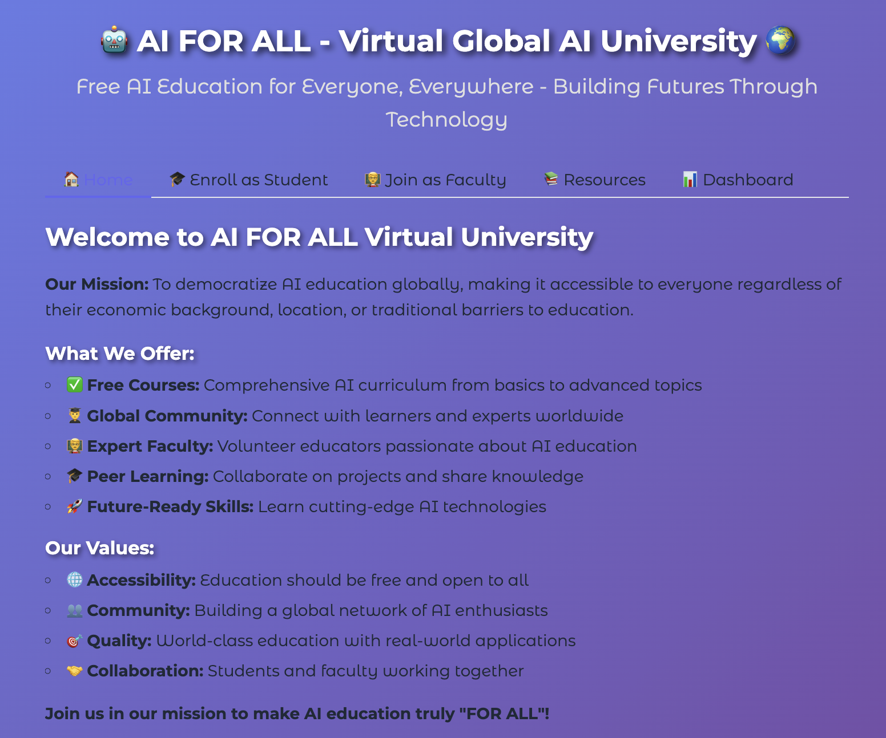

<div align="center">
  

  <h1>🤖 AI for All Virtual University</h1>

  <p><em>Empowering global AI education for everyone, everywhere</em></p>

  <p>
    
    
    
    
    
    
  </p>

  <p style="font-size:50%;">
    <span style="color:#FF6B6B;font-weight:bold;">20+</span>&nbsp;Courses • 
    <span style="color:#4ECDC4;font-weight:bold;">4</span>&nbsp;Levels • 
    <span style="color:#45B7D1;font-weight:bold;">∞</span>&nbsp;Students
  </p>

  <br>

  <span style="font-size:50%;"><strong>Mission:</strong> Enable everyone to learn and build AI step by step.<br>
  <strong>Vision:</strong> Democratize AI so it's accessible to all, empowering innovation.<br>
  <strong>Goal:</strong> Empowering global AI education for everyone, everywhere.</span>

  <br>

  <p>
    <a href="https://srinipusuluri.github.io/ai-for-all/"></a>
    <a href="https://www.linkedin.com/in/pusulurisrinivasa/"></a>
    <a href="https://docs.google.com/forms/d/1CbYODkVmHtE_vVCywD6EyOP0i9fWCiDmjv7bomAE4Wo/viewform"></a>
    <a href="https://docs.google.com/forms/d/e/1FAIpQLSfZMPiXsYL1CbFz5fIVTf-qiah8I53zo2GGAq8_2zwYKPkd_g/viewform"></a>
  </p>

  <br>

  **[🎯 Interactive Course Catalog](docs/index.html)** | **[📚 GitHub Repository](https://github.com/srinipusuluri/ai-for-all-global-university)**

</div>

A comprehensive, accessible AI education platform providing structured course materials for learners at all levels, from high school students to advanced researchers.

## 🎓 Course Curriculum

<div align="center">

### 📊 Learning Statistics
<p>
  
  
  
  
</p>

</div>

### 🎯 Learning Levels Overview

| Level | Target Audience | Focus Areas | Duration |
|-------|----------------|-------------|----------|
| **1️⃣ Foundations** | Beginners, High School | Basic Programming, Math, AI Concepts | 2-4 weeks |
| **2️⃣ Intermediate** | Students, Enthusiasts | ML/DL Theory, Data Science | 1-2 months |
| **3️⃣ Specialized** | Practitioners | Domain Expertise, Advanced Topics | 2-3 months |
| **4️⃣ Advanced** | Researchers, Experts | Architecture, Cutting-edge | 3-6 months |
| **5️⃣ Assessment** | All Learners | Knowledge Testing, Practice | Ongoing |

<hr>

<h2 align="left">
  <span style="color:#FF6B6B;">
    🔥 Level 1: Foundations
  </span>
</h2>
- **High School AI** - Age-appropriate AI introduction for younger students
- **AI Basics** - Introduction to Artificial Intelligence fundamentals
- **Python Programming for AI** - Python essentials for AI development
- **Mathematics for AI** - Mathematical foundations required for AI/ML
- **AI Math Study Guide** - Comprehensive mathematical concepts for AI learners
- **Python Tutor** - Interactive Python learning for AI beginners

<h2 align="left">
  <span style="color:#4ECDC4;">
    🌊
    Level 2: Intermediate
  </span>
</h2>
- **Advanced AI Concepts** - Deep dive into advanced AI technologies
- **College-Level AI Programs** - University-level AI curriculum
- **AI Datasets & Data Science** - Working with AI datasets and data preparation
- **AI/ML/LLM Interactive Learning Platform** - Machine Learning, Deep Learning, and Large Language Models

<h2 align="left">
  <span style="color:#45B7D1;">
    🎯 Level 3: Specialized Topics
  </span>
</h2>
- **Generative AI** - Modern generative AI techniques and applications
- **Vision AI** - Computer vision and image processing with AI
- **Voice Learning** - Speech recognition and natural language processing
- **AI Agents** - Autonomous AI systems and agent development

<h2 align="left">
  <span style="color:#96CEB4;">
    🚀 Level 4: Advanced Concepts
  </span>
</h2>
- **Transformer Architecture** - Understanding transformer models (GPT, BERT, etc.)
- **Autoencoders** - Neural network architectures for data compression and generation

<h2 align="left">
  <span style="color:#FECA57;">
    📝 Level 5: Assessment & Practice
  </span>
</h2>
- **AI Quizzes** - Test your knowledge with interactive quizzes covering all levels
  - [`Python High School Quiz`](quizs/python-highschool/PythonHighSchool.html)
  - [`Python Programming Quiz`](quizs/python/python_quiz.html)
  - [`AI Basics Quiz`](quizs/aibasics/AIBasics.html)
  - [`AI Advanced Quiz`](quizs/aiadvanced/AIAdvanced.html)
  - [`GenAI Interview Questions`](quizs/genai-interview/GenAI-Interview.html)

<h2 align="left">
  <span style="color:#6C5CE7;">
    📖 How to Access Courses
  </span>
</h2>

<h3 align="left">
  <span style="color:#A8E6CF;">
    🚀 Quick Start
  </span>
</h3>

<div align="center">

```
🌐 Browser Access
├── 🎯 Interactive Homepage → docs/index.html
└── 📚 Direct Course Access → docs/any-course.html

💻 Local Development
├── Clone Repository → git clone <repo-url>
├── Navigate → cd AI_FOR_ALL_Virtual_University
└── Open Browser → docs/index.html

📱 Mobile Friendly
└── All courses work on phones and tablets!
```

</div>

### 🎯 Course Access Methods

**🌐 Direct Browser Access (Recommended):**
- Visit the [Interactive Course Catalog](docs/index.html) for a beautiful overview
- Click any course card to start learning immediately
- All courses are self-contained HTML files

**💻 Local Development:**
```bash
git clone https://github.com/srinipusuluri/ai-for-all-global-university
cd AI_FOR_ALL_Virtual_University
open docs/index.html  # macOS
# or
start docs/index.html  # Windows
# or
xdg-open docs/index.html  # Linux
```

### 📚 Available Course Formats

| Format | Access | Features |
|--------|--------|----------|
| **🎨 Visual Interface** | [Homepage](docs/index.html) | Cards, animations, search |
| **📄 Standalone HTML** | `docs/*.html` | Self-contained, embeddable |
| **📝 Interactive Quizzes** | `quizs/` | Progressive difficulty |

<hr>

## 🏗️ Repository Structure

<div align="center">

```
📁 AI_FOR_ALL_Virtual_University/
├── 🏠 docs/                 → HTML course materials & homepage
│   ├── index.html          → Interactive course catalog
│   ├── 1-*.html            → Foundation level courses
│   ├── 2-*.html            → Intermediate courses
│   ├── 4-*.html            → Specialized topics
│   └── 5-*.html            → Advanced courses
├── 🧠 images/              → Welcome images & assets
├── 📝 quizs/               → Interactive assessments
│   ├── python/             → Python quizzes
│   ├── aiadvanced/         → Advanced AI tests
│   ├── aibasics/           → Foundation quizzes
│   ├── python-highschool/  → High school level tests
│   └── genai-interview/    → Interview prep questions
├── 📖 README.md            → This documentation
└── ⚙️ .git/                → Version control
```

</div>

## 🎯 Learning Objectives

- Provide **democratic access** to AI education worldwide
- Cover AI from **basic concepts** to **cutting-edge research**
- Track progression from **novice** to **expert level**
- Include **practical projects** and **real-world applications**

## 🤝 Contributing

We welcome contributions to expand and improve our AI education materials:

1. Fork the repository
2. Create a feature branch
3. Add your course materials or improvements
4. Submit a pull request

## 📚 Resources

- Courses are designed to be **self-paced** and **interactive**
- HTML format ensures **universal accessibility**
- No prerequisites for Level 1 courses
- Progressive difficulty curve

## 📄 License

This educational content is provided as-is for learning purposes. Please respect the educational intent and contribute back to the community.

---

*Empowering global AI education for everyone, everywhere.* 🤖📚
